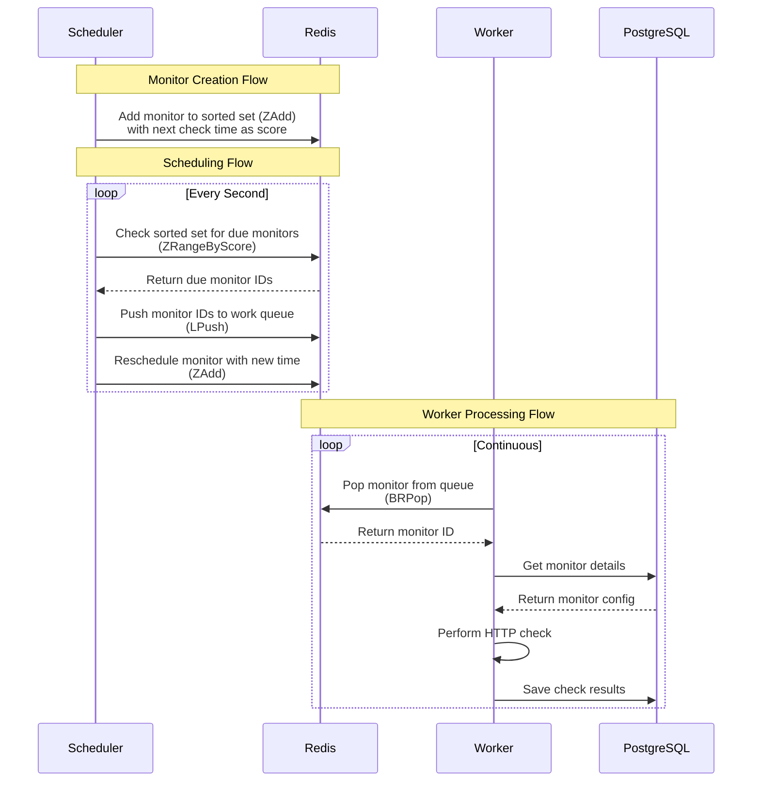

# Pinguin

Pinguin is an uptime monitoring tool for your web services written in Go.

This is very much a work in progress. My main motivation for writing this is to learn Go and to build something useful.

> [!CAUTION]
> Currently, there is no frontend for Pinguin, but it is coming soon.

## Requirements

- docker
- make

## How to Install

> [!NOTE]
> This is a work in progress. Ideally, this should be a single docker compose-file or a docker image.

To start Pinguin:

1. Clone the repository

2. Install dependencies  
   This will install the dependencies listed in the [Brewfile](Brewfile).

   ```bash
   make install
   ```

3. Start the server  
   This will use the docker compose file to spin up 3 containers:

   - `db`: TimescaleDB
   - `redis`: Redis
   - `server`: Pinguin server

   ```bash
   make up
   ```

## Pinguin Architecture

Pinguin stores monitor data in [TimescaleDB](https://www.timescale.com/) (which is a Postgres extension).

Pinguin uses Redis as its primary data pipeline for monitoring. It uses a sorted set to store the next check time for each monitor and a list to store the monitors to be checked.


