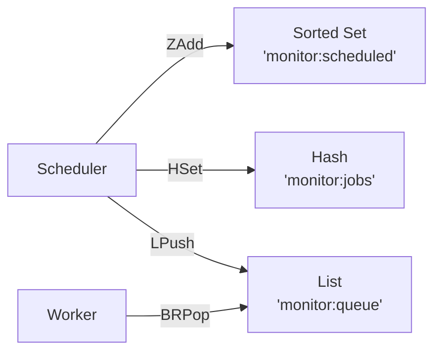

# Pinguin

Pinguin is an uptime monitoring tool for your web services written in Go.

This is very much a work in progress. My main motivation for writing this is to learn Go and to build something useful.
I chose Postgres and TimescaleDB for the database because I am familiar with Postgres and I have heard good things about TimescaleDB.

I also decided to use Redis for the data pipeline because I am familiar with Redis and wanted to explore how sorted sets could be used to implement a scheduler. This might be overkill for this use case, but I wanted to try it out.

## Requirements (wip)

- docker
- make
- golang-migrate

## How to Install

Should be a single docker compose file that can be used to run the server and redis.

To turn up the development environment:

```bash
make up
```

## Monitoring Architecture

Pinguin uses Redis as its primary data pipeline for monitoring.


